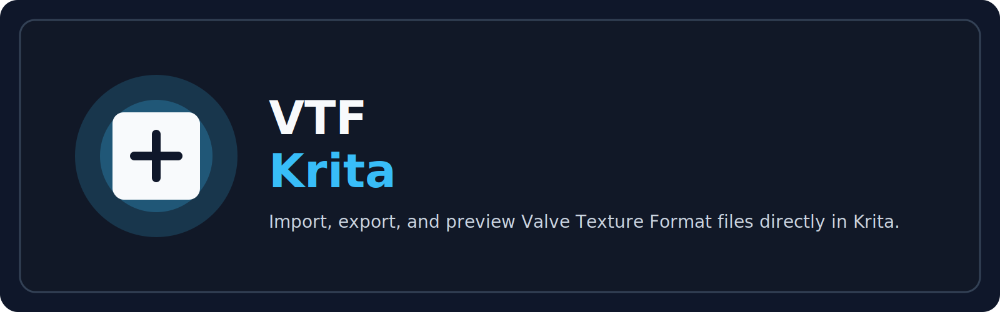

# VTF Krita

A Krita plugin for importing and exporting Valve Texture Format (.vtf) files, with optional .vmt material generation.

## What this project is

This repository contains a full source release of a Krita plugin that adds:

- VTF import support
- VTF export support
- optional VMT material export
- cross-platform support for Windows and Linux builds of the bundled native library

The plugin is built around a patched VTFLib fork and a portable DXT/S3TC compression backend, so it can work without the proprietary Windows-only nvDXTLib dependency used by some older builds.

## Disclaimer

This project was assembled with assistance from Claude by Anthropic. The underlying plugin logic and packaging work were heavily guided by that assistance, but the actual code changes in the Krita-side Python integration are relatively small and focused on the plugin's import/export workflow.

## Project layout

- [BUILD.md](BUILD.md) — build instructions for the bundled native library
- [PATCHES.md](PATCHES.md) — notes on the small VTFLib patches applied here
- [patches.diff](patches.diff) — the patch set used for the bundled VTFLib fork
- [VTFLib](VTFLib) — patched VTFLib source
- [libtxc_dxtn](libtxc_dxtn) — portable DXT/S3TC compression backend
- [licenses](licenses) — license texts for bundled third-party code
- [krita-plugin-source](krita-plugin-source) — the Krita plugin Python sources

## Building and installing

1. Read [BUILD.md](BUILD.md) and build the native library for your platform.
2. Place the resulting shared library in the plugin's expected binary location:
   - Windows: [krita-plugin-source/bin/windows](krita-plugin-source/bin/windows)
   - Linux: [krita-plugin-source/bin/linux](krita-plugin-source/bin/linux)
3. Copy the plugin folder into Krita's Python plugin directory and enable it from Krita's Python Plugin Manager.

## License notes

This repository bundles third-party code and license files from:

- VTFLib
- libtxc_dxtn
- the upstream VTF-related source tree this plugin was derived from

Please review the files in [licenses](licenses) before redistribution or commercial use.

## Status

This repository is intended as a source package and development archive. It is suitable for private hosting right now, and it can be polished further with a better screenshot set, icon art, and a more polished install guide before going public.
